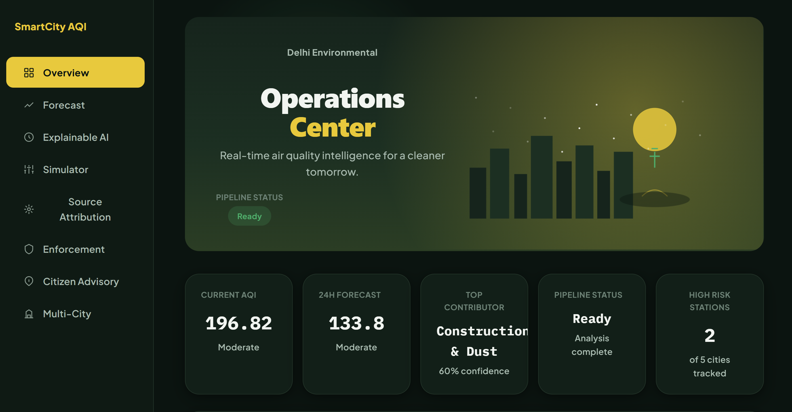
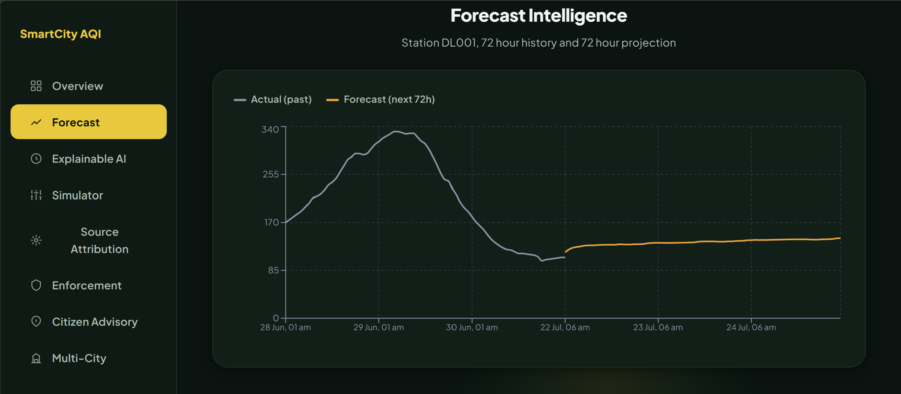
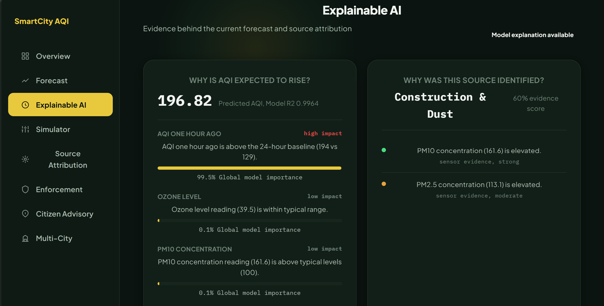
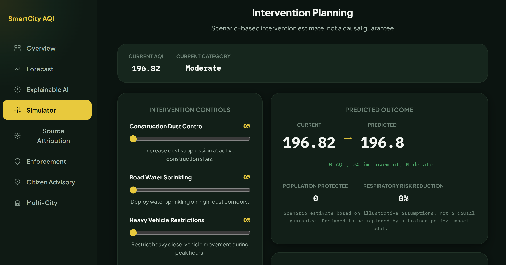
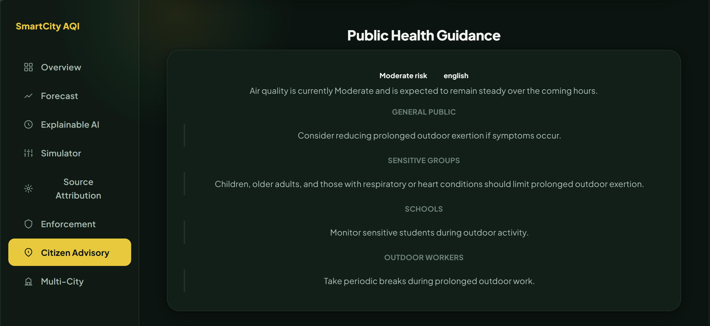

# SmartCity AQI Intelligence Platform
Decision Support Platform for AQI Forecasting, Source Attribution, and Municipal Response Planning.
Full-stack AI-powered decision support system built with React, FastAPI, and Machine Learning for proactive urban air quality management.

---
## Contents

- Overview
- Problem Statement
- Solution
- System Architecture
- Key Features
- Technology Stack
- Machine Learning Pipeline
- API Modules
- Repository Structure
- Product Workflow
- Getting Started
- Environment Variables
- Deployment
- Limitations
- Future Improvements
- Team

## Overview

SmartCity AQI Intelligence Platform is a full-stack decision-support system designed to help municipal authorities monitor, forecast, and respond to urban air quality conditions.

The platform combines a trained machine learning forecasting model with an explainable analytics pipeline that estimates future AQI, identifies likely pollution contributors, recommends operational interventions, and generates multilingual public health guidance through a unified dashboard.

Unlike conventional AQI dashboards that only display historical measurements, this platform focuses on supporting operational decision-making through forecasting, explanation, and response planning.

---

## Live Deployment

| Service | URL |
|---------|-----|
| Frontend | https://smart-city-air-quality-ai.vercel.app |
| Backend | https://smartcity-aqi-backend.onrender.com |
| API Docs | https://smartcity-aqi-backend.onrender.com/docs |

---

## Dashboard




---

## Problem Statement

Urban air quality management remains largely reactive.

Although historical monitoring data is publicly available through CPCB monitoring stations, city administrations often lack systems that can:

- forecast AQI before deterioration
- explain why air quality is changing
- identify likely pollution sources
- recommend operational responses
- communicate public health guidance to different audiences

As a result, interventions are often delayed and rely heavily on manual interpretation of monitoring data.

---

## Solution

The platform integrates multiple components into a single decision-support workflow.

1. Forecast future AQI using a trained machine learning model.
2. Explain forecast drivers through feature importance analysis.
3. Estimate likely pollution contributors using transparent evidence scoring.
4. Recommend municipal response strategies based on forecast severity.
5. Generate multilingual public health guidance for different user groups.
6. Allow operators to evaluate intervention scenarios before implementation.

The objective is to assist decision-makers with timely, explainable, and actionable information rather than simply displaying environmental data.

---

## System Architecture

```
                React Frontend (Vercel)
                        │
                        ▼
              FastAPI Backend (Render)
                        │
        ┌───────────────┼───────────────┐
        ▼               ▼               ▼
   Forecast        Attribution       Trend Engine
        │               │
        └───────┬───────┘
                ▼
        Decision Context
                ▼
    Response Planning & Advisory
                ▼
      Unified API Response
                ▼
        Interactive Dashboard
```

The frontend communicates with a FastAPI backend through REST APIs.

The backend loads a trained GradientBoostingRegressor during application startup and shares the model across multiple API routers. The primary orchestration endpoint executes forecasting, source attribution, decision-context generation, response planning, and public health guidance before returning a consolidated response consumed by the frontend.
---
## Key Features

### AQI Forecasting

- Station-level AQI prediction using a trained GradientBoostingRegressor
- Feature engineering with lag-based temporal features
- Historical trend visualization
- Multi-day forecast support



### Explainable AI

- Feature contribution analysis for every prediction
- Transparent explanation of forecast drivers
- Decision context generated from model outputs



### Source Attribution

- Evidence-based estimation of dominant pollution contributors
- Contribution scoring across multiple pollution sources
- Explainable attribution instead of black-box classification

### Intervention Simulator

- Evaluate the potential impact of different mitigation strategies
- Compare intervention scenarios before implementation
- Support operational planning and decision-making



### Public Health Advisory

- AQI-specific health recommendations
- Multilingual advisory generation
- Audience-specific guidance for citizens and administrators



### Dashboard

- Interactive React-based interface
- Real-time API integration
- Station comparison
- Historical trend visualization
- Forecast analytics
- Operational response recommendations

---

## Technology Stack

| Layer | Technology |
|-------|------------|
| Frontend | React 19, Vite, Axios |
| Backend | FastAPI, Uvicorn |
| Machine Learning | scikit-learn |
| Model | GradientBoostingRegressor |
| Data Processing | Pandas, NumPy |
| Visualization | Recharts, Leaflet |
| Deployment | Vercel, Render |

---

## Machine Learning Pipeline

### Dataset

The model is trained on historical CPCB air quality observations obtained from the **Air Quality Data in India** dataset available on Kaggle.

### Data Processing

- Missing value handling
- Feature engineering
- Temporal lag feature generation
- Train-test split
- Model training
- Model serialization

### Engineered Features

Engineered features include:

- Previous AQI
- Rolling averages
- Pollutant concentrations
- Weather variables
- Temporal features

### Model

The forecasting model uses **GradientBoostingRegressor** from scikit-learn.

### Model Performance

| Metric | Value |
|--------|-------|
| R² Score | 0.9964 |
| RMSE | 6.25 |

---

## API Modules

The backend is organized into independent FastAPI routers.

| Module | Purpose |
|---------|---------|
| Forecast | AQI prediction |
| Attribution | Pollution source estimation |
| Trend | Historical trend analysis |
| Intervention | Response planning |
| Enforcement | Municipal recommendations |
| Advisory | Public health guidance |
| Pipeline | End-to-end orchestration |
| Stations | Station metadata |
| Multicity | Regional comparison |

---

## Repository Structure

```text
SmartCity-AirQuality-AI/
│
├── backend/              FastAPI backend and API routers
│   ├── routers/
│   ├── models/
│   ├── services/
│   ├── utils/
│   └── main.py
│
├── frontend/             React application
│   ├── src/
│   ├── components/
│   ├── pages/
│   └── assets/
│    
├── ml/                       Model training scripts
│
├── datasets/            Raw and processed datasets
│
├── notebooks/        Experiments and analysis
│
├── screenshots/      Application screenshots
│
└── README.md
```

---

## Product Workflow

1. User requests an AQI forecast.
2. Backend generates the prediction using the trained ML model.
3. Explainability module analyzes the prediction.
4. Source attribution estimates probable pollution contributors.
5. Decision context combines all outputs.
6. Intervention engine recommends municipal actions.
7. Public health advisory is generated.
8. A unified response is returned to the frontend.
---

## Getting Started

### Clone the Repository

```bash
git clone https://github.com/Coder1713/SmartCity-AirQuality-AI.git
cd SmartCity-AirQuality-AI
```

---

### Backend Setup

```bash
cd backend

python -m venv venv

# Windows
venv\Scripts\activate

# Linux / macOS
source venv/bin/activate

pip install -r requirements.txt

uvicorn main:app --reload
```

The backend will be available at:

```
http://127.0.0.1:8000
```

Interactive API documentation:

```
http://127.0.0.1:8000/docs
```

---

### Frontend Setup

```bash
cd frontend

npm install

npm run dev
```

The frontend will be available at:

```
http://localhost:5173
```

---

## Environment Variables

### Backend

Create a `.env` file inside the `backend` directory.

```env
ANTHROPIC_API_KEY=your_api_key
```

---

### Frontend

Create a `.env` file inside the `frontend` directory.

```env
VITE_API_URL=http://127.0.0.1:8000
```

For production deployment, update the backend URL accordingly.

---

## Deployment

| Component | Platform |
|----------|----------|
| Frontend | Vercel |
| Backend | Render |

The frontend communicates with the deployed FastAPI backend using REST APIs.

---

## Current Limitations

- Forecast quality depends on the availability and quality of historical observations.
- Source attribution is evidence-based and should be interpreted as decision support rather than definitive source identification.
- Intervention simulation provides estimated outcomes and is not intended to replace domain expertise.
- The current implementation focuses on historical station-level data and does not incorporate live sensor streams.

---

## Future Improvements

Potential extensions include:

- Real-time CPCB API integration
- Live weather API integration
- Time-series deep learning models (LSTM / Transformer)
- Satellite and remote sensing data integration
- Automated anomaly detection
- Multi-city scaling
- Mobile application support
- Citizen reporting module
- Role-based authentication
- Historical intervention effectiveness tracking

---

## Team

This project was developed as part of a two-member team.

| Member | Contribution |
|--------|--------------|
| Aryan Arya | Backend development, backend API integration, backend deployment |
| Anjali Singh | Frontend development, user interface implementation, machine learning pipeline, data processing, model training, dashboard implementation |

---

## Acknowledgements

This project was developed as part of the Flipkart Gridlock Hackathon.

Historical air quality observations used for model development were obtained from publicly available CPCB data distributed through the *Air Quality Data in India* dataset.

---
